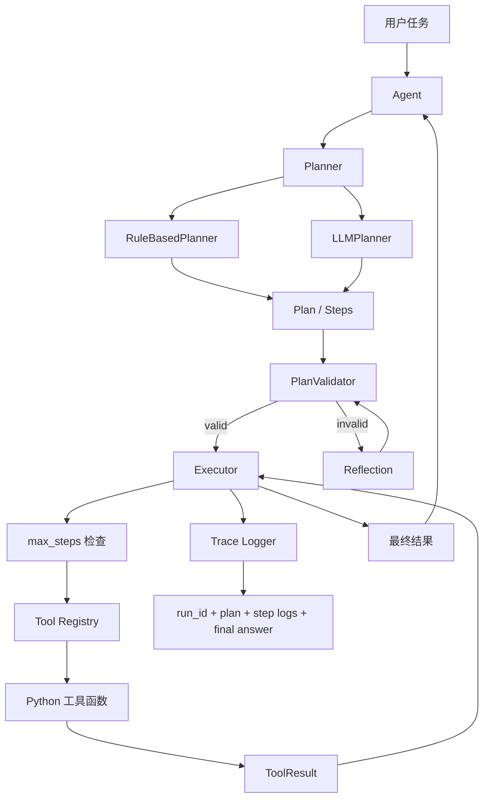

# MiniAgentLab：轻量级 Agent 编排框架

MiniAgentLab 是一个半学习、半实践的轻量级 Agent 编排框架项目。它的目标不是一开始就复刻 LangChain、AutoGen 或 CrewAI，而是从一个可运行、可测试、可观察的最小闭环开始，逐步理解并实现 Agent 系统中的核心工程模块。

当前版本已经完成一个最小闭环：

```text
用户任务
-> Planner 生成执行计划
-> Tool Registry 查找工具
-> Executor 调用工具并处理重试
-> Trace Logger 记录执行轨迹
-> Agent 汇总结果
```

## 当前架构图



你可以把这个项目理解为一个 Agent 框架学习实验室：每个模块都尽量小而清楚，方便继续扩展成网页检索 Agent、SQL 分析 Agent、文档问答 Agent 或多工具自动化 Agent。

## 项目定位

MiniAgentLab 主要用于学习和实践以下能力：

- Agent 的任务分解与执行流程
- 函数工具注册与统一调用
- 工具调用失败后的错误处理与重试
- 执行轨迹 Trace 的记录与导出
- 可测试的 Agent 框架设计
- 后续接入 LLM Planner、Memory、Reflection 的工程结构

这个项目适合作为个人项目、简历项目或 Agent 工程学习项目。

## 当前能力

当前版本是 `v0.1.0`，重点是把最小闭环跑通。

已经实现：

- `Agent`：统一协调 Planner、Executor、ToolRegistry 和 TraceLogger
- `RuleBasedPlanner`：基于规则的确定性 Planner，用于测试和最小闭环演示
- `LLMPlanner`：调用 LLM 生成结构化 JSON 计划，并在解析失败时重试修复
- `OpenAICompatibleLLM`：使用标准库封装 OpenAI-compatible chat completions API，可读取 `.env`
- `PlannerContext`：把对话历史等上下文传给 Planner，避免 Planner 直接依赖 Agent 内部状态
- `OperationHint`：对“上一步结果 + 加减乘除”这类 follow-up 指令做确定性解析
- `ShortTermMemory`：保存单次 Agent 运行中的 step 输出，供后续模块读取上下文
- `ConversationMemory`：保存多次 `agent.run()` 之间的 user / assistant 对话历史
- `ToolRegistry`：支持注册 Python 函数工具，并统一返回调用结果
- `Executor`：顺序执行计划步骤，支持失败重试和 `max_steps` 步数上限
- `TraceLogger`：记录任务、`run_id`、计划、每一步工具调用、输出、错误和最终结果
- `calculator` 示例工具：安全执行基础数学表达式
- 单元测试：覆盖工具注册、重复注册、未知工具、参数错误、calculator 异常、Agent 最小闭环执行、`run_id`、`max_steps`、`LLMPlanner`、`PlannerContext`、`OperationHint`、`ShortTermMemory` 和 `ConversationMemory`

后续仍待实现的扩展方向：

- `VectorMemory`：文档检索记忆
- `Reflection`：失败分析、参数修正、重新规划
- SQL 分析 Agent
- 文档问答 Agent
- 网页检索 Agent

## 环境信息

本项目当前使用 Conda 环境：

```powershell
conda activate D:\conda_envs\miniagentlab
```

Python 版本：

```text
Python 3.11.15
```

如果你需要重新创建环境，可以参考：

```powershell
$env:CONDA_PKGS_DIRS="D:\conda_pkgs"
D:\miniconda3\Scripts\conda.exe create -y -p D:\conda_envs\miniagentlab python=3.11 pip
```

## 项目结构

```text
MiniAgentLab/
  miniagentlab/
    __init__.py
    agent.py              # Agent 主协调器
    builtin_tools.py      # 内置工具，例如 calculator
    executor.py           # 执行计划步骤
    llm.py                # OpenAI-compatible LLM 客户端
    memory.py             # 短期记忆与对话记忆
    planner.py            # Planner 抽象、规则 Planner 与 LLMPlanner
    schemas.py            # Plan、Step、PlannerContext、ToolResult 等数据结构
    tool_registry.py      # 工具注册与调用
    trace.py              # 执行轨迹记录与导出
  examples/
    calculator_agent.py   # 最小闭环示例
    llm_planner_agent.py  # LLMPlanner 示例
  tests/
    test_minimal_loop.py  # 单元测试
    test_llm_planner.py   # LLMPlanner 单元测试
    test_memory.py        # ShortTermMemory 单元测试
    test_conversation_memory.py # ConversationMemory 单元测试
  traces/
    calculator_trace.json # 示例运行后生成的 Trace
  pyproject.toml
  .env.example
  README.md
```

## 快速开始

进入项目目录：

```powershell
cd D:\MiniAgentLab
```

激活环境：

```powershell
conda activate D:\conda_envs\miniagentlab
```

运行最小闭环示例：

```powershell
python examples\calculator_agent.py
```

你应该看到类似输出：

```text
Done: 计算 123 * 456，并解释结果
Result: 56088
Trace saved to: traces\calculator_trace.json
```

运行单元测试：

```powershell
python -m unittest discover -s tests
```

预期输出：

```text
Ran 68 tests in 0.642s

OK
```

## 使用 LLMPlanner

如果要让大模型负责生成计划，可以先准备 `.env`。不要把真实 `.env` 提交到 Git。

```powershell
copy .env.example .env
```

然后填写：

```text
DEEPSEEK_API_KEY=你的 key
LLM_BASE_URL=https://api.deepseek.com
LLM_MODEL=deepseek-v4-flash
```

运行 LLMPlanner 示例：

```powershell
python examples\llm_planner_agent.py
```

这个示例会让 LLM 输出结构化 JSON 计划，再交给现有的 `Executor` 和 `ToolRegistry` 执行。单元测试不会调用真实 API，而是使用 `FakeLLM` 返回固定 JSON，避免测试依赖网络和模型费用。

## 最小闭环示例说明

当前示例任务是：

```text
计算 123 * 456，并解释结果
```

执行流程如下：

```text
1. Agent 接收用户任务
2. RuleBasedPlanner 从任务中提取数学表达式：123 * 456
3. Planner 生成一个 Step，指定调用 calculator 工具
4. Executor 查找 calculator 工具并执行
5. ToolRegistry 返回统一的 ToolResult
6. TraceLogger 记录计划、工具参数、输出、耗时
7. Agent 汇总最终结果
```

对应生成的计划大致如下：

```json
{
  "goal": "计算 123 * 456，并解释结果",
  "steps": [
    {
      "id": "step_1",
      "description": "Evaluate the arithmetic expression.",
      "tool": "calculator",
      "args": {
        "expression": "123 * 456"
      }
    }
  ]
}
```

## 核心模块设计

### Agent

`Agent` 是整个系统的入口，负责串联完整流程：

```text
task -> plan -> execute -> trace -> final answer
```

它不直接关心某个工具怎么实现，也不直接决定任务怎么拆解，而是把职责交给 Planner、Executor 和 ToolRegistry。

### Planner

Planner 负责把用户任务转成结构化计划。

当前实现的是 `RuleBasedPlanner`，它只处理简单计算任务。这个设计的好处是稳定、可测试，适合作为项目第一步。

后续可以增加 `LLMPlanner`：

```text
用户任务
-> Prompt
-> LLM 输出 JSON
-> 校验为 Plan
-> 交给 Executor
```

### Tool Registry

`ToolRegistry` 用于管理工具函数。

它解决三个问题：

- 工具如何注册
- 工具如何按名称查找
- 工具调用失败后如何统一返回错误

示例：

```python
registry = ToolRegistry()
registry.register(calculator, name="calculator")

result = registry.call("calculator", expression="2 + 3 * 4")
```

返回结果统一是：

```python
ToolResult(success=True, output="14", error=None)
```

### Executor

Executor 负责执行计划中的每一个步骤。

它目前支持：

- 顺序执行
- 工具调用
- 失败重试
- 每次尝试写入 Trace

后续可以扩展：

- 最大步骤数限制
- 并行步骤执行
- 条件分支
- 失败后触发 Reflection
- 工具调用超时控制

### Trace Logger

Trace 是 Agent 项目里非常重要的一部分。没有 Trace，Agent 失败时很难知道问题出在哪里。

当前 Trace 会记录：

- 用户任务
- 开始时间
- 执行计划
- 每一步工具调用
- 工具参数
- 工具输出
- 错误信息
- 单步耗时
- 最终答案
- 结束时间

示例文件：

```text
traces/calculator_trace.json
```

## 为什么保留 RuleBasedPlanner

这个项目第一步故意使用 `RuleBasedPlanner`，而不是马上依赖大模型。

原因是：

- 规则 Planner 稳定，方便写测试
- 可以先验证 Agent 框架本身是否合理
- 避免一开始把错误来源混在一起
- 接入 LLM 时，只需要替换 Planner，不需要重写整个框架

一个成熟的 Agent 框架应该能做到：

```text
同一个 Executor + ToolRegistry + TraceLogger
既能跑 RuleBasedPlanner
也能跑 LLMPlanner
```

这也是当前架构的核心设计思想。

## 后续开发路线

### 第 1 阶段：完善最小框架

目标：让当前框架更稳。

已完成任务：

- 增加更多 calculator 异常测试
- 增加未知工具调用测试
- 增加工具参数错误测试
- 给 Trace 增加 `run_id`
- 给 Executor 增加 `max_steps`
- 给 README 增加架构图

### 第 2 阶段：接入 LLMPlanner

目标：让大模型根据用户任务生成计划。

已完成基础接入：

- 新增 `miniagentlab/llm.py`
- 从 `.env` 读取 `LLM_BASE_URL`、`LLM_MODEL`、`DEEPSEEK_API_KEY`
- 新增 `LLMPlanner`
- 要求 LLM 只输出 JSON
- 对 JSON 做格式校验
- JSON 解析失败时自动重试一次
- 使用 `FakeLLM` 编写不依赖真实 API 的单元测试
- 新增 `examples/llm_planner_agent.py`

注意事项：

- 不要把 API Key 写进 README 或提交到 Git
- `.env` 已经被 `.gitignore` 忽略
- LLM 输出一定要校验，不能直接相信

### 第 3 阶段：实现 Memory

目标：让 Agent 能保存上下文。

已完成简单版本：

```text
ShortTermMemory
-> 保存当前任务中的中间结果
-> 每次 agent.run() 开始时清空
-> 每个成功 step 的输出会写入 memory[step_id]
-> 后续 step 可以用 "$memory.step_id" 引用前面 step 的输出
-> AgentResult.memory 会返回本次运行的 memory snapshot

ConversationMemory
-> 保存多轮对话历史
-> 不会在每次 agent.run() 开始时清空
-> Agent 会自动记录 user task 和 assistant final_answer
-> AgentResult.conversation 会返回截至本次运行的对话历史

PlannerContext
-> Agent 在规划前读取当前任务之前的 ConversationMemory
-> LLMPlanner 只取最近 N 轮 conversation 写入 prompt
-> 当前 user task 仍然通过 task 单独传入，避免在 prompt 中重复

OperationHint
-> Agent 对当前 task 做轻量规则解析
-> 识别“刚才/上一步/previous/that”等引用词和加减乘除操作
-> 当存在 prior result + operation hint + calculator 工具时，LLMPlanner 会走确定性 fast path
-> 例如 prior result=100，hint operator="-", operand="12"，直接生成 expression "100 - 12"
```

示例计划：

```json
{
  "goal": "复用前一步结果",
  "steps": [
    {
      "id": "step_1",
      "description": "计算数值",
      "tool": "calculator",
      "args": {"expression": "3 * 7"}
    },
    {
      "id": "step_2",
      "description": "使用前一步结果",
      "tool": "label_value",
      "args": {"value": "$memory.step_1"}
    }
  ]
}
```

当前规则：

- 只有完整字符串形式的 `"$memory.step_1"` 会被替换
- `dict` 和 `list` 中的引用会递归解析
- 引用不存在时，当前 step 会失败并写入 Trace

后续再考虑：

- SQLite 持久化
- 文档 chunk 存储
- 向量检索
- 记忆摘要

### 第 4 阶段：实现 Reflection

目标：让 Agent 在失败后有修正能力。

典型场景：

```text
工具调用失败
-> Reflection 分析错误
-> 修改参数
-> 重试工具
```

Reflection 不应该只是生成一段自然语言，而应该输出结构化动作：

```json
{
  "action": "retry_with_new_args",
  "reason": "参数 expression 中包含非法字符",
  "new_args": {
    "expression": "123 * 456"
  }
}
```

### 第 5 阶段：做 SQL 分析 Agent

目标：让 Agent 能分析本地 SQLite 数据库。

建议工具：

- `list_tables`
- `describe_table`
- `run_sql`

安全限制：

- 第一版只允许 `SELECT`
- 禁止 `DROP`、`DELETE`、`UPDATE`、`INSERT`
- 给 SQL 查询设置行数上限

这个示例很适合展示 Agent 的工具编排能力。

### 第 6 阶段：做文档问答 Agent

目标：让 Agent 能读取本地文档并回答问题。

建议流程：

```text
load_document
-> chunk_text
-> retrieve_chunks
-> answer_question
```

第一版可以先用关键词匹配，后续再接 embedding。

### 第 7 阶段：做网页检索 Agent

目标：让 Agent 能搜索网页、抓取页面、总结信息并给出来源。

建议工具：

- `search_web`
- `fetch_page`
- `extract_text`
- `summarize`

注意事项：

- 网络请求容易失败，要做好异常处理
- 需要记录来源 URL
- 总结时要区分事实和模型推断

## 常见问题与解决思路

### 1. LLM 输出格式不稳定

解决方法：

- 要求只输出 JSON
- 用数据结构校验
- 失败时让模型修复 JSON
- 保留原始输出到 Trace，方便排查

### 2. Agent 无限重试

解决方法：

- 设置 `max_retries`
- 设置 `max_steps`
- 设置 `max_reflections`
- 每次失败都写入 Trace

### 3. 工具参数不匹配

解决方法：

- 注册工具时读取函数签名
- 调用前校验参数
- 错误信息标准化

### 4. Trace 太乱

解决方法：

- 每个 Agent run 增加 `run_id`
- 每个 Step 增加稳定的 `step_id`
- 工具输入输出都转成 JSON 可序列化格式
- 大文本输出只保存摘要或截断版本

### 5. 项目容易变成“套壳”

解决方法：

- 不要只调用现成 Agent 框架
- 重点实现自己的编排逻辑
- 重点展示 ToolRegistry、Executor、Trace、Retry、Reflection
- README 中解释每个模块为什么这样设计

## 简历描述参考

如果作为简历项目，可以这样描述：

```text
MiniAgentLab：轻量级 Agent 编排框架

- 实现 Planner、Tool Registry、Executor、Trace Logger 等核心模块，支持函数工具注册、任务分解、顺序执行、失败重试与执行轨迹导出。
- 构建 calculator 最小闭环示例，完成从用户任务、计划生成、工具调用到 Trace 记录的完整 Agent 执行流程。
- 使用单元测试覆盖工具注册、重复注册、Agent 执行闭环等关键逻辑，为后续 LLMPlanner、Memory、Reflection 和多类型 Agent 示例扩展预留接口。
```

后续实现 SQL、文档问答、网页检索后，可以升级为：

```text
- 提供 SQL 分析 Agent、文档问答 Agent、网页检索 Agent 示例，覆盖结构化数据分析、非结构化文档检索和外部信息获取等典型 Agent 应用场景。
```

## 当前状态

当前项目已经可以：

- 创建并使用 Conda 环境
- 运行 calculator Agent 示例
- 生成执行 Trace
- 运行单元测试

下一步推荐优先做：

```text
LLMPlanner -> Memory -> Reflection -> SQL Agent
```

这样项目会从“最小闭环”逐步变成真正有展示价值的 Agent 编排框架。
## SQLite 分析 Agent 第一版

当前已经加入本地 SQLite 只读分析能力：

- `miniagentlab/sql_tools.py`
- `examples/sql_agent.py`
- `tests/test_sql_tools.py`
- `tests/test_sql_agent.py`

第一版支持：

- `list_tables(db_path)`：查看用户表
- `describe_table(db_path, table_name)`：查看表结构
- `run_sql(db_path, sql, max_rows=50)`：执行单条只读 `SELECT/WITH` 查询
- 拒绝 `DELETE`、`UPDATE`、`DROP`、多语句 SQL 等危险操作

运行示例：

```powershell
python examples\sql_agent.py
```

当前完整测试：

```text
Ran 62 tests in 0.619s
OK
```
